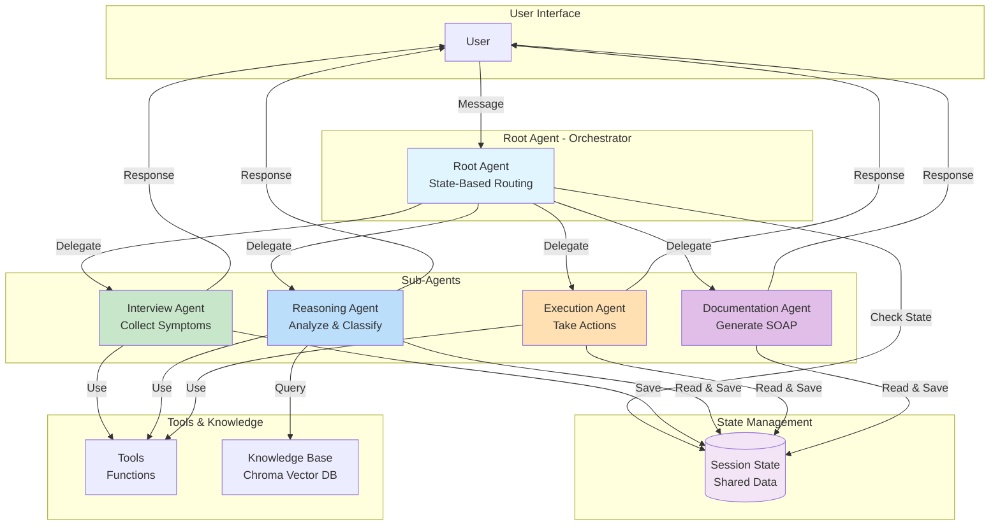
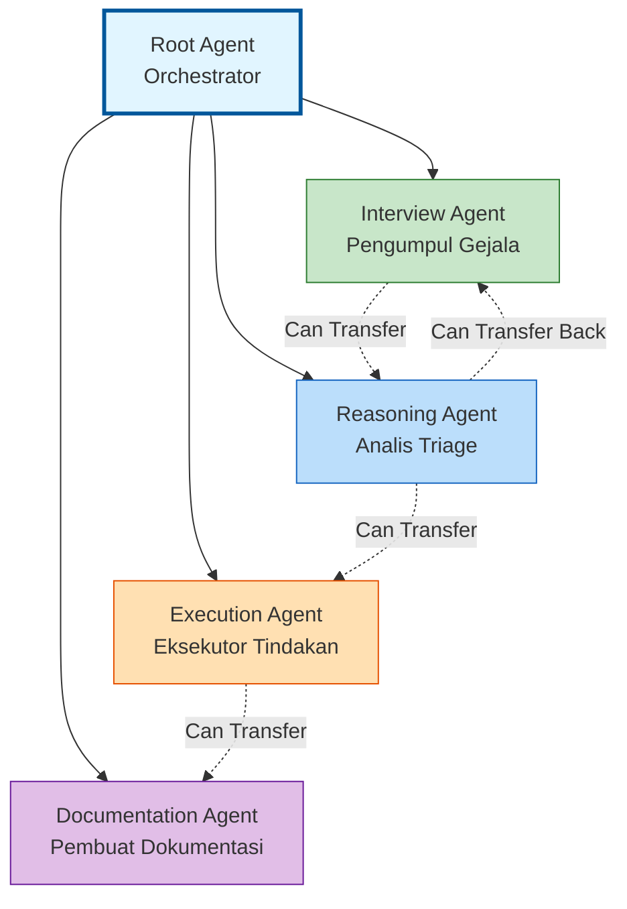
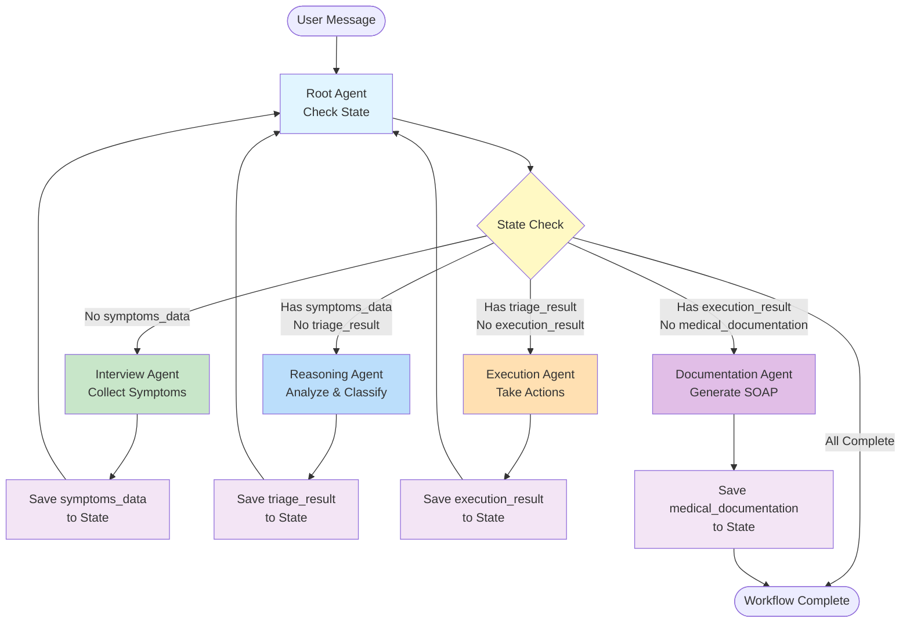
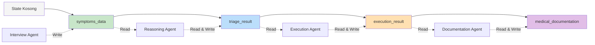

# Simple Agentic AI Architecture

Dokumen ini menjelaskan arsitektur sistem agentic AI untuk Medical Triage Agent dengan cara yang sederhana dan mudah dipahami.

> 📖 **Untuk pengguna non-teknis**: Jika Anda mencari penjelasan yang lebih sederhana tanpa istilah teknis, silakan baca [AGENTIC_AI_ARCHITECTURE_SIMPLE.md](./AGENTIC_AI_ARCHITECTURE_SIMPLE.md) yang menggunakan analogi dan bahasa sehari-hari.

## 📋 Daftar Isi

1. [Konsep Dasar](#konsep-dasar)
2. [Struktur Agent](#struktur-agent)
3. [Alur Kerja (Workflow)](#alur-kerja-workflow)
4. [Manajemen State](#manajemen-state)
5. [Tools & Knowledge Base](#tools--knowledge-base)
6. [Pola Delegasi](#pola-delegasi)

---

## Konsep Dasar

### Apa itu Agentic AI?

**Agentic AI** adalah sistem AI yang terdiri dari beberapa **agent** (agen) yang bekerja sama untuk menyelesaikan tugas kompleks. Setiap agent memiliki peran spesifik dan dapat berkomunikasi dengan agent lain.

### Komponen Utama

1. **Agent**: Entitas AI yang memiliki tugas spesifik
2. **State**: Data yang dibagikan antar agent selama proses berlangsung
3. **Delegation**: Proses mengalihkan tugas dari satu agent ke agent lain
4. **Tools**: Fungsi yang dapat dipanggil agent untuk melakukan aksi tertentu
5. **Knowledge Base**: Database pengetahuan yang dapat diakses agent

### Diagram Arsitektur Sederhana



---

## Struktur Agent

Sistem ini menggunakan **hierarki agent** dengan pola **LLM-Driven Delegation**:

### Hierarki Agent



### Text Hierarchy

```
root_agent (Orchestrator)
├── interview_agent (Pengumpul Gejala)
├── reasoning_agent (Analis Triage)
├── execution_agent (Eksekutor Tindakan)
└── documentation_agent (Pembuat Dokumentasi)
```

### 1. Root Agent (Orchestrator)

**Peran**: Koordinator utama yang mengatur alur kerja

**Tugas**:

- Membaca state untuk mengetahui progress workflow
- Mendelegasikan tugas ke agent yang tepat berdasarkan state
- Mengelola alur komunikasi dengan user

**Karakteristik**:

- Tidak menangani tugas medis secara langsung
- Hanya bertugas routing dan koordinasi
- Menggunakan **state-based routing** untuk menentukan agent berikutnya

### 2. Interview Agent

**Peran**: Mengumpulkan gejala dari pasien

**Tugas**:

- Melakukan wawancara dinamis dengan pasien
- Mengumpulkan informasi gejala (durasi, tingkat keparahan, gejala penyerta)
- Mengekstrak gejala ke format JSON terstruktur
- Menyimpan hasil ke `symptoms_data` di state

**Tools**:

- `extract_symptoms`: Mengekstrak gejala dari teks ke JSON
- `query_bates_guide`: Mencari panduan wawancara dari Bates Guide

**Output**: `symptoms_data` (JSON)

### 3. Reasoning Agent

**Peran**: Menganalisis gejala dan menentukan tingkat urgensi

**Tugas**:

- Membaca `symptoms_data` dari state
- Menganalisis gejala terhadap kriteria BPJS dan PPK Kemenkes
- Mengklasifikasikan triage level (Gawat Darurat / Mendesak / Non-Urgen)
- Menyimpan hasil klasifikasi ke `triage_result` di state

**Tools**:

- `check_bpjs_criteria`: Memeriksa kriteria gawat darurat BPJS
- `query_bpjs_criteria_tool`: Semantic search untuk kriteria BPJS
- `query_ppk_kemenkes_tool`: Semantic search untuk panduan PPK Kemenkes
- `query_knowledge_base_tool`: Query umum ke knowledge base

**Output**: `triage_result` (klasifikasi + justifikasi)

**Fitur Khusus**:

- Dapat mentransfer kembali ke `interview_agent` jika data tidak lengkap
- Menggunakan **Thinking Mode** untuk reasoning yang lebih dalam

### 4. Execution Agent

**Peran**: Mengambil tindakan berdasarkan triage level

**Tugas**:

- Membaca `triage_result` dari state
- Mengambil tindakan sesuai triage level:
  - **Gawat Darurat**: Memanggil layanan darurat, ambulans
  - **Mendesak**: Scan jadwal dokter, jadwalkan telehealth
  - **Non-Urgen**: Berikan panduan self-care
- Menyimpan hasil tindakan ke `execution_result` di state

**Tools**:

- `call_emergency_service`: Memanggil layanan darurat
- `schedule_mobile_jkn`: Menjadwalkan kunjungan Mobile JKN
- `get_self_care_guide`: Memberikan panduan perawatan mandiri
- `query_fktp_registered`: Query FKTP terdaftar pasien
- `query_nearest_facility`: Mencari faskes terdekat
- `query_jkn_medical_history`: Mengambil riwayat medis

**Output**: `execution_result` (tindakan yang diambil)

### 5. Documentation Agent

**Peran**: Membuat dokumentasi medis (SOAP)

**Tugas**:

- Membaca semua data dari state (`symptoms_data`, `triage_result`, `execution_result`)
- Membuat dokumentasi SOAP (Subjective, Objective, Assessment, Plan)
- Menyimpan dokumentasi ke `medical_documentation` di state

**Output**: `medical_documentation` (SOAP note)

---

## Alur Kerja (Workflow)

### Flow Diagram



### Text Flow Diagram

```
User Message
    ↓
Root Agent (cek state)
    ↓
┌─────────────────────────────────────┐
│ State Check:                        │
│ - symptoms_data?                    │
│ - triage_result?                    │
│ - execution_result?                 │
│ - medical_documentation?            │
└─────────────────────────────────────┘
    ↓
    ├─→ [Tidak ada] → Interview Agent
    │                      ↓
    │                 symptoms_data
    │                      ↓
    ├─→ [Ada symptoms_data] → Reasoning Agent
    │                            ↓
    │                       triage_result
    │                            ↓
    ├─→ [Ada triage_result] → Execution Agent
    │                             ↓
    │                        execution_result
    │                             ↓
    └─→ [Ada execution_result] → Documentation Agent
                                       ↓
                                  medical_documentation
                                       ↓
                                    Selesai
```

### Tahapan Workflow

#### Tahap 1: Pengumpulan Gejala

1. **Root Agent** → Delegasi ke **Interview Agent**
2. **Interview Agent** → Wawancara pasien → Ekstrak gejala → Simpan ke `symptoms_data`
3. **Root Agent** (dipanggil lagi) → Deteksi `symptoms_data` ada → Delegasi ke **Reasoning Agent**

#### Tahap 2: Analisis & Klasifikasi

1. **Reasoning Agent** → Baca `symptoms_data` → Analisis → Klasifikasi triage → Simpan ke `triage_result`
2. **Root Agent** (dipanggil lagi) → Deteksi `triage_result` ada → Delegasi ke **Execution Agent**

#### Tahap 3: Eksekusi Tindakan

1. **Execution Agent** → Baca `triage_result` → Ambil tindakan sesuai level → Simpan ke `execution_result`
2. **Root Agent** (dipanggil lagi) → Deteksi `execution_result` ada → Delegasi ke **Documentation Agent**

#### Tahap 4: Dokumentasi

1. **Documentation Agent** → Baca semua data → Generate SOAP → Simpan ke `medical_documentation`
2. **Root Agent** → Deteksi `medical_documentation` ada → Workflow selesai

### Contoh Alur Lengkap

```
User: "Halo, saya pusing"
    ↓
Root Agent: "Halo! Saya Smart Triage Agent..."
    ↓ [delegasi]
Interview Agent: "Bisakah ceritakan lebih detail?"
    ↓
User: "Pusing berputar, 3 hari, sangat mengganggu"
    ↓
Interview Agent: [ekstrak gejala] → symptoms_data = {...}
    ↓ [delegasi kembali]
Root Agent: [deteksi symptoms_data] → [delegasi]
    ↓
Reasoning Agent: [analisis] → triage_result = "Gawat Darurat"
    ↓ [delegasi kembali]
Root Agent: [deteksi triage_result] → [delegasi]
    ↓
Execution Agent: [panggil ambulans] → execution_result = {...}
    ↓ [delegasi kembali]
Root Agent: [deteksi execution_result] → [delegasi]
    ↓
Documentation Agent: [generate SOAP] → medical_documentation = {...}
    ↓
Root Agent: "Proses triase selesai"
```

---

## Manajemen State

### Apa itu State?

**State** adalah data yang dibagikan antar agent selama proses berlangsung. State disimpan di **Session State** dan dapat diakses oleh semua agent.

### State Keys

| Key                     | Agent yang Menulis  | Agent yang Membaca                   | Deskripsi                                       |
| ----------------------- | ------------------- | ------------------------------------ | ----------------------------------------------- |
| `patient_location`      | Root Agent          | Semua Agent                          | Lokasi pasien                                   |
| `is_proxy_user`         | Root Agent          | Semua Agent                          | Apakah user proxy (menanyakan untuk orang lain) |
| `symptoms_data`         | Interview Agent     | Reasoning Agent, Documentation Agent | Data gejala dalam format JSON                   |
| `triage_result`         | Reasoning Agent     | Execution Agent, Documentation Agent | Hasil klasifikasi triage                        |
| `execution_result`      | Execution Agent     | Documentation Agent                  | Tindakan yang telah diambil                     |
| `medical_documentation` | Documentation Agent | -                                    | Dokumentasi SOAP final                          |

### State Flow



### Text State Flow

```
State Kosong
    ↓
[symptoms_data] ← Interview Agent
    ↓
[triage_result] ← Reasoning Agent
    ↓
[execution_result] ← Execution Agent
    ↓
[medical_documentation] ← Documentation Agent
```

### Cara Agent Menggunakan State

1. **Membaca State**: Agent membaca state dari context untuk mengetahui progress
2. **Menulis State**: Agent menulis hasil ke state menggunakan `output_key`
3. **State-Based Routing**: Root Agent menggunakan state untuk menentukan agent berikutnya

**Contoh**:

```python
# Interview Agent menyimpan hasil
output_key="symptoms_data"  # Otomatis disimpan ke state

# Reasoning Agent membaca state
# Di context: state['symptoms_data'] = {...}
# Agent dapat membaca dan menggunakan data ini
```

---

## Tools & Knowledge Base

### Tools

**Tools** adalah fungsi yang dapat dipanggil agent untuk melakukan aksi tertentu. Setiap agent memiliki tools yang sesuai dengan perannya.

#### Interview Agent Tools

- `extract_symptoms`: Ekstraksi gejala ke JSON
- `query_bates_guide`: Query panduan wawancara

#### Reasoning Agent Tools

- `check_bpjs_criteria`: Cek kriteria BPJS
- `query_bpjs_criteria_tool`: Semantic search BPJS
- `query_ppk_kemenkes_tool`: Semantic search PPK Kemenkes
- `query_knowledge_base_tool`: Query umum

#### Execution Agent Tools

- `call_emergency_service`: Panggil layanan darurat
- `schedule_mobile_jkn`: Jadwalkan kunjungan
- `get_self_care_guide`: Panduan self-care
- `query_fktp_registered`: Query FKTP terdaftar
- `query_nearest_facility`: Cari faskes terdekat
- `query_jkn_medical_history`: Riwayat medis

### Knowledge Base

**Knowledge Base** adalah database pengetahuan yang dapat diakses agent melalui semantic search (Chroma Vector DB).

#### Sumber Pengetahuan

1. **BPJS Criteria**: Pedoman BPJS Kriteria Gawat Darurat
2. **PPK Kemenkes**: Pedoman Pelayanan Primer Kesehatan
3. **Bates Guide**: Panduan pemeriksaan fisik

#### Cara Kerja

- Agent melakukan **semantic search** ke Chroma Vector DB
- Query berdasarkan makna, bukan hanya kata kunci
- Hasil relevan dikembalikan untuk digunakan agent

**Contoh**:

```python
# Reasoning Agent query knowledge base
query_ppk_kemenkes_tool("nyeri perut kanan bawah dengan demam")
# → Mengembalikan informasi relevan tentang apendisitis
```

---

## Pola Delegasi

### LLM-Driven Delegation

Sistem ini menggunakan **LLM-Driven Delegation**, di mana Root Agent (LLM) membaca state dan memutuskan agent mana yang harus dipanggil selanjutnya.

### State-Based Routing

Root Agent menggunakan **state-based routing** untuk menentukan agent berikutnya:

```python
if not state.get('symptoms_data'):
    → delegate to interview_agent
elif not state.get('triage_result'):
    → delegate to reasoning_agent
elif not state.get('execution_result'):
    → delegate to execution_agent
elif not state.get('medical_documentation'):
    → delegate to documentation_agent
else:
    → workflow selesai
```

### Transfer Between Agents

Agent dapat mentransfer langsung ke agent lain menggunakan `transfer_to_agent`:

```python
# Interview Agent → Reasoning Agent
transfer_to_agent(agent_name='reasoning_agent')

# Reasoning Agent → Interview Agent (jika data tidak lengkap)
transfer_to_agent(agent_name='interview_agent')
```

### Delegasi Langsung vs Melalui Root

1. **Melalui Root** (Recommended): Agent menyelesaikan tugas → Root Agent deteksi state → Delegasi ke agent berikutnya
2. **Langsung**: Agent dapat mentransfer langsung ke agent lain jika diperlukan (misalnya: Reasoning Agent kembali ke Interview Agent jika data tidak lengkap)

---

## Keuntungan Arsitektur Ini

### 1. Modularity

- Setiap agent memiliki peran yang jelas dan terpisah
- Mudah untuk menambah atau mengubah agent tanpa mempengaruhi agent lain

### 2. Scalability

- Mudah menambah agent baru untuk tugas spesifik
- Setiap agent dapat dikembangkan secara independen

### 3. Maintainability

- Kode lebih mudah dipahami dan dirawat
- Debugging lebih mudah karena setiap agent terisolasi

### 4. Flexibility

- State-based routing memungkinkan workflow yang dinamis
- Agent dapat mentransfer tugas jika diperlukan

### 5. Specialization

- Setiap agent fokus pada satu tugas spesifik
- Tools dan knowledge base dapat dioptimalkan per agent

---

## Kesimpulan

Arsitektur agentic AI ini menggunakan pola **hierarki agent dengan LLM-Driven Delegation** dan **state-based routing**. Setiap agent memiliki peran spesifik dan berkomunikasi melalui shared state. Pola ini memungkinkan sistem yang modular, scalable, dan mudah dirawat.

### Prinsip Utama

1. **Separation of Concerns**: Setiap agent fokus pada satu tugas
2. **State as Communication**: Agent berkomunikasi melalui shared state
3. **LLM-Driven Routing**: Root Agent menggunakan LLM untuk routing yang cerdas
4. **Tool Specialization**: Setiap agent memiliki tools yang sesuai perannya
5. **Knowledge Base Integration**: Agent dapat mengakses knowledge base untuk informasi

---

## Referensi

- [ADK Documentation](https://github.com/google/adk)
- [Multi-Agent Systems](agent_docs/multi_agent_system.md)
- [Architecture Details](ARCHITECTURE.md)
