# Cara Kerja Sistem Triage Medis - Penjelasan Sederhana

Dokumen ini menjelaskan bagaimana sistem triase medis bekerja dengan bahasa yang mudah dipahami, tanpa istilah teknis yang rumit.

## 📖 Daftar Isi

1. [Apa itu Sistem Ini?](#apa-itu-sistem-ini)
2. [Bayangkan Seperti Tim Dokter](#bayangkan-seperti-tim-dokter)
3. [Bagaimana Sistem Bekerja?](#bagaimana-sistem-bekerja)
4. [Contoh Nyata](#contoh-nyata)
5. [Pertanyaan Umum](#pertanyaan-umum)

---

## Apa itu Sistem Ini?

### Penjelasan Sederhana

Bayangkan Anda sedang sakit dan perlu bantuan medis. Biasanya, Anda harus:

1. Pergi ke rumah sakit atau puskesmas
2. Menunggu antrian
3. Menjelaskan gejala ke dokter
4. Dokter menentukan seberapa urgent kondisi Anda
5. Dokter memberikan tindakan yang tepat

**Sistem ini melakukan hal yang sama, tapi secara digital!**

Sistem ini adalah **asisten medis pintar** yang:

- ✅ Mengajukan pertanyaan tentang gejala Anda
- ✅ Menganalisis seberapa urgent kondisi Anda
- ✅ Memberikan rekomendasi tindakan yang tepat
- ✅ Mencatat semua informasi untuk dokter

**Keuntungannya:**

- 🕐 Tersedia 24 jam, kapan saja
- 🏠 Bisa digunakan dari rumah
- ⚡ Lebih cepat dari antrian rumah sakit
- 📝 Semua informasi tercatat rapi untuk dokter

---

## Bayangkan Seperti Tim Dokter

Sistem ini bekerja seperti **tim dokter** yang terdiri dari 5 anggota, masing-masing punya tugas khusus:

### Diagram Tim Dokter


### 👨‍⚕️ Anggota Tim

#### 1. **Koordinator (Root Agent)**

**Tugas**: Mengatur siapa yang harus bekerja selanjutnya

**Seperti apa?**

- Seperti **resepsionis di rumah sakit** yang mengarahkan pasien ke dokter yang tepat
- Tidak menangani pasien langsung, tapi memastikan pasien bertemu dengan dokter yang tepat

**Apa yang dilakukan?**

- Menerima pesan dari Anda
- Memeriksa "buku catatan tim" untuk melihat progress
- Mengarahkan ke anggota tim yang tepat

#### 2. **Perawat Wawancara (Interview Agent)**

**Tugas**: Mengajukan pertanyaan tentang gejala Anda

**Seperti apa?**

- Seperti **perawat di ruang triase** yang menanyakan gejala sebelum bertemu dokter
- Mengajukan pertanyaan yang tepat untuk memahami kondisi Anda

**Apa yang dilakukan?**

- Mengajukan pertanyaan: "Sudah berapa lama?", "Seberapa sakit?", "Ada gejala lain?"
- Mencatat semua jawaban Anda
- Menuliskan catatan rapi di "buku catatan tim"

#### 3. **Dokter Analis (Reasoning Agent)**

**Tugas**: Menganalisis gejala dan menentukan tingkat urgensi

**Seperti apa?**

- Seperti **dokter senior** yang membaca catatan perawat dan menentukan seberapa urgent kondisi pasien
- Menggunakan buku pedoman medis untuk memastikan keputusan tepat

**Apa yang dilakukan?**

- Membaca catatan gejala dari perawat wawancara
- Membandingkan dengan pedoman medis (BPJS, Kemenkes)
- Menentukan tingkat urgensi:
  - 🔴 **Gawat Darurat**: Perlu penanganan segera (misalnya: serangan jantung)
  - 🟠 **Mendesak**: Perlu penanganan dalam 24-48 jam (misalnya: apendisitis)
  - 🟢 **Non-Urgen**: Bisa ditangani di rumah atau konsultasi rutin (misalnya: pilek ringan)

#### 4. **Koordinator Tindakan (Execution Agent)**

**Tugas**: Mengambil tindakan sesuai tingkat urgensi

**Seperti apa?**

- Seperti **staf administrasi** yang mengatur:
  - Memanggil ambulans untuk kasus gawat darurat
  - Menjadwalkan kunjungan dokter untuk kasus mendesak
  - Memberikan panduan perawatan di rumah untuk kasus non-urgen

**Apa yang dilakukan?**

- **Untuk Gawat Darurat**: Memanggil ambulans, menghubungi rumah sakit terdekat
- **Untuk Mendesak**: Mencari jadwal dokter, menjadwalkan konsultasi
- **Untuk Non-Urgen**: Memberikan panduan perawatan di rumah

#### 5. **Pencatat Medis (Documentation Agent)**

**Tugas**: Mencatat semua informasi dalam format medis standar

**Seperti apa?**

- Seperti **sekretaris medis** yang menulis catatan medis lengkap
- Menulis dalam format SOAP (catatan medis standar)

**Apa yang dilakukan?**

- Mengumpulkan semua informasi dari tim
- Menulis catatan medis lengkap (SOAP)
- Menyimpan untuk dokter yang akan menangani Anda

---

## Bagaimana Sistem Bekerja?

### Alur Kerja Sederhana

Bayangkan Anda sedang **mengunjungi rumah sakit digital**:

```mermaid
flowchart TD
    START([Anda: "Saya pusing"]) --> COORD1[Koordinator<br/>Menerima Pesan]

    COORD1 --> CHECK{Buku Catatan<br/>Masih Kosong?}

    CHECK -->|Ya| NURSE[Perawat Wawancara<br/>Bertanya: "Sudah berapa lama?<br/>Seberapa sakit?"]
    CHECK -->|Tidak, ada catatan gejala| DOCTOR[Dokter Analis<br/>Membaca catatan<br/>Menentukan urgensi]
    CHECK -->|Tidak, ada keputusan| ADMIN[Koordinator Tindakan<br/>Mengambil tindakan]
    CHECK -->|Tidak, ada tindakan| SECRETARY[Pencatat Medis<br/>Membuat catatan SOAP]

    NURSE --> ANSWER[Anda: "3 hari,<br/>sangat mengganggu"]
    ANSWER --> SAVE1[Mencatat di<br/>Buku Catatan]
    SAVE1 --> COORD2[Koordinator<br/>Melihat catatan ada]

    COORD2 --> DOCTOR
    DOCTOR --> DECISION[Keputusan:<br/>"Gawat Darurat"]
    DECISION --> SAVE2[Mencatat di<br/>Buku Catatan]
    SAVE2 --> COORD3[Koordinator<br/>Melihat keputusan ada]

    COORD3 --> ADMIN
    ADMIN --> ACTION[Memanggil ambulans<br/>Hubungi rumah sakit]
    ACTION --> SAVE3[Mencatat di<br/>Buku Catatan]
    SAVE3 --> COORD4[Koordinator<br/>Melihat tindakan ada]

    COORD4 --> SECRETARY
    SECRETARY --> SOAP[Catatan Medis<br/>Lengkap - SOAP]
    SOAP --> END([Selesai!<br/>Anda mendapat rekomendasi])

    style COORD1 fill:#e1f5ff
    style COORD2 fill:#e1f5ff
    style COORD3 fill:#e1f5ff
    style COORD4 fill:#e1f5ff
    style NURSE fill:#c8e6c9
    style DOCTOR fill:#bbdefb
    style ADMIN fill:#ffe0b2
    style SECRETARY fill:#e1bee7
    style CHECK fill:#fff9c4
    style SAVE1 fill:#f3e5f5
    style SAVE2 fill:#f3e5f5
    style SAVE3 fill:#f3e5f5
    style START fill:#fff9c4
    style END fill:#c8e6c9
```

### Alur Kerja dalam Teks

```
1. Anda mengirim pesan: "Saya pusing"
   ↓
2. Koordinator menerima pesan
   ↓
3. Koordinator melihat "buku catatan tim" masih kosong
   → Mengarahkan ke Perawat Wawancara
   ↓
4. Perawat Wawancara mengajukan pertanyaan:
   "Sudah berapa lama? Seberapa sakit?"
   ↓
5. Anda menjawab: "3 hari, sangat mengganggu"
   ↓
6. Perawat mencatat di "buku catatan tim"
   ↓
7. Koordinator melihat catatan sudah ada
   → Mengarahkan ke Dokter Analis
   ↓
8. Dokter Analis membaca catatan, membandingkan dengan pedoman
   → Menentukan: "Gawat Darurat"
   → Mencatat keputusan di "buku catatan tim"
   ↓
9. Koordinator melihat keputusan sudah ada
   → Mengarahkan ke Koordinator Tindakan
   ↓
10. Koordinator Tindakan membaca keputusan
    → Memanggil ambulans, menghubungi rumah sakit
    → Mencatat tindakan di "buku catatan tim"
    ↓
11. Koordinator melihat tindakan sudah diambil
    → Mengarahkan ke Pencatat Medis
    ↓
12. Pencatat Medis membaca semua catatan
    → Menulis catatan medis lengkap (SOAP)
    → Menyimpan untuk dokter
    ↓
13. Selesai! Anda mendapat rekomendasi dan catatan medis lengkap
```

### "Buku Catatan Tim" (State)

**Apa itu?**

- Seperti **buku catatan bersama** yang digunakan semua anggota tim
- Setiap anggota menulis hasil kerjanya di buku ini
- Anggota lain bisa membaca untuk melanjutkan pekerjaan

```mermaid
flowchart LR
    subgraph "Buku Catatan Tim"
        EMPTY[Buku Kosong]
        PAGE1[📝 Catatan Gejala<br/>dari Perawat Wawancara]
        PAGE2[🔍 Keputusan Urgensi<br/>dari Dokter Analis]
        PAGE3[⚡ Tindakan yang Diambil<br/>dari Koordinator Tindakan]
        PAGE4[📋 Catatan Medis Lengkap<br/>dari Pencatat Medis]
    end

    EMPTY -->|Perawat menulis| PAGE1
    PAGE1 -->|Dokter membaca & menulis| PAGE2
    PAGE2 -->|Koordinator membaca & menulis| PAGE3
    PAGE3 -->|Pencatat membaca & menulis| PAGE4

    NURSE[Perawat Wawancara] -.->|Menulis| PAGE1
    DOCTOR[Dokter Analis] -.->|Membaca & Menulis| PAGE2
    ADMIN[Koordinator Tindakan] -.->|Membaca & Menulis| PAGE3
    SECRETARY[Pencatat Medis] -.->|Membaca & Menulis| PAGE4

    PAGE1 -.->|Dibaca oleh| DOCTOR
    PAGE2 -.->|Dibaca oleh| ADMIN
    PAGE3 -.->|Dibaca oleh| SECRETARY

    style EMPTY fill:#f5f5f5
    style PAGE1 fill:#c8e6c9
    style PAGE2 fill:#bbdefb
    style PAGE3 fill:#ffe0b2
    style PAGE4 fill:#e1bee7
    style NURSE fill:#c8e6c9
    style DOCTOR fill:#bbdefb
    style ADMIN fill:#ffe0b2
    style SECRETARY fill:#e1bee7
```



**Isi buku catatan:**

1. **Catatan Gejala** (dari Perawat Wawancara)

   - Gejala apa yang dialami
   - Sudah berapa lama
   - Seberapa parah

2. **Keputusan Urgensi** (dari Dokter Analis)

   - Gawat Darurat / Mendesak / Non-Urgen
   - Alasan keputusan

3. **Tindakan yang Diambil** (dari Koordinator Tindakan)

   - Ambulans dipanggil
   - Atau jadwal dokter dibuat
   - Atau panduan perawatan diberikan

4. **Catatan Medis Lengkap** (dari Pencatat Medis)
   - Semua informasi ditulis dalam format standar
   - Siap untuk dokter yang akan menangani

### Mengapa Sistem Ini Efisien?

**Seperti tim dokter yang terorganisir:**

- ✅ Setiap anggota fokus pada tugasnya
- ✅ Tidak ada pekerjaan yang terlewat
- ✅ Semua informasi tercatat rapi
- ✅ Keputusan berdasarkan pedoman medis resmi

**Berbeda dengan sistem biasa:**

- ❌ Satu orang harus melakukan semua tugas (lambat, mudah salah)
- ❌ Informasi bisa terlewat atau tidak tercatat
- ❌ Keputusan bisa tidak konsisten

---

## Contoh Nyata

### Diagram Tiga Tingkat Urgensi

```mermaid
graph TD
    subgraph "Tingkat Urgensi"
        URGENT[🔴 Gawat Darurat<br/>Perlu penanganan segera<br/>Contoh: Serangan jantung,<br/>Pusing berputar parah]
        URGENT2[🟠 Mendesak<br/>Perlu penanganan 24-48 jam<br/>Contoh: Apendisitis,<br/>Nyeri perut kanan bawah]
        NON[🟢 Non-Urgen<br/>Bisa ditangani di rumah<br/>Contoh: Pilek ringan,<br/>Pusing ringan]
    end

    subgraph "Tindakan"
        URGENT --> ACTION1[Memanggil ambulans<br/>Hubungi IGD terdekat]
        URGENT2 --> ACTION2[Jadwalkan konsultasi<br/>dengan dokter]
        NON --> ACTION3[Berikan panduan<br/>perawatan di rumah]
    end

    style URGENT fill:#ffcdd2,stroke:#c62828
    style URGENT2 fill:#ffe0b2,stroke:#e65100
    style NON fill:#c8e6c9,stroke:#2e7d32
    style ACTION1 fill:#ffcdd2
    style ACTION2 fill:#ffe0b2
    style ACTION3 fill:#c8e6c9
```



### Skenario 1: Pusing Ringan (Non-Urgen)

**Anda**: "Saya pusing ringan setelah bangun tidur"

```mermaid
flowchart TD
    START([Anda: "Pusing ringan<br/>setelah bangun tidur"]) --> NURSE[Perawat Wawancara<br/>Bertanya detail]
    NURSE --> ANSWER[Anda: "Baru saja,<br/>ringan, sudah membaik"]
    ANSWER --> DOCTOR[Dokter Analis<br/>Membaca catatan]
    DOCTOR --> DECISION[Keputusan:<br/>🟢 Non-Urgen]
    DECISION --> ADMIN[Koordinator Tindakan<br/>Berikan panduan<br/>perawatan di rumah]
    ADMIN --> SECRETARY[Pencatat Medis<br/>Mencatat informasi]
    SECRETARY --> RESULT[Hasil:<br/>Panduan perawatan<br/>+ Catatan medis]

    style START fill:#fff9c4
    style NURSE fill:#c8e6c9
    style DOCTOR fill:#bbdefb
    style DECISION fill:#c8e6c9,stroke:#2e7d32,stroke-width:3px
    style ADMIN fill:#ffe0b2
    style SECRETARY fill:#e1bee7
    style RESULT fill:#c8e6c9
```

**Yang Terjadi:**

1. **Perawat Wawancara** bertanya: "Sudah berapa lama? Seberapa sakit?"
2. Anda jawab: "Baru saja, ringan, sudah membaik"
3. **Dokter Analis** membaca catatan, menentukan: **Non-Urgen**
4. **Koordinator Tindakan** memberikan panduan perawatan di rumah
5. **Pencatat Medis** mencatat semua informasi

**Hasil**: Anda mendapat panduan perawatan di rumah dan catatan medis untuk konsultasi rutin nanti.

### Skenario 2: Nyeri Perut Kanan Bawah (Mendesak)

**Anda**: "Anak saya sakit perut kanan bawah, demam"

```mermaid
flowchart TD
    START([Anda: "Anak sakit perut<br/>kanan bawah, demam"]) --> NURSE[Perawat Wawancara<br/>Bertanya detail]
    NURSE --> ANSWER[Anda: "6 jam, cukup parah,<br/>demam 38.2°C, mual"]
    ANSWER --> DOCTOR[Dokter Analis<br/>Membaca & membandingkan<br/>dengan pedoman]
    DOCTOR --> DECISION[Keputusan:<br/>🟠 Mendesak<br/>Kecurigaan apendisitis]
    DECISION --> ADMIN[Koordinator Tindakan<br/>Cari jadwal dokter bedah<br/>Jadwalkan konsultasi<br/>telehealth besok]
    ADMIN --> SECRETARY[Pencatat Medis<br/>Mencatat informasi]
    SECRETARY --> RESULT[Hasil:<br/>Jadwal konsultasi<br/>+ Catatan medis<br/>Jika memburuk → IGD]

    style START fill:#fff9c4
    style NURSE fill:#c8e6c9
    style DOCTOR fill:#bbdefb
    style DECISION fill:#ffe0b2,stroke:#e65100,stroke-width:3px
    style ADMIN fill:#ffe0b2
    style SECRETARY fill:#e1bee7
    style RESULT fill:#ffe0b2
```

**Yang Terjadi:**

1. **Perawat Wawancara** bertanya detail: durasi, tingkat keparahan, gejala lain
2. Anda jawab: "6 jam, cukup parah, demam 38.2°C, mual"
3. **Dokter Analis** membaca catatan, membandingkan dengan pedoman, menentukan: **Mendesak** (kecurigaan apendisitis)
4. **Koordinator Tindakan** mencari jadwal dokter bedah, menjadwalkan konsultasi telehealth besok
5. **Pencatat Medis** mencatat semua informasi

**Hasil**: Anda mendapat jadwal konsultasi dengan dokter bedah dan catatan medis lengkap. Jika gejala memburuk, langsung ke IGD.

### Skenario 3: Pusing Berputar Parah (Gawat Darurat)

**Anda**: "Saya pusing berputar sangat parah, tidak bisa berdiri"

```mermaid
flowchart TD
    START([Anda: "Pusing berputar<br/>sangat parah,<br/>tidak bisa berdiri"]) --> NURSE[Perawat Wawancara<br/>Bertanya detail gejala]
    NURSE --> ANSWER[Anda: "3 hari, sangat<br/>mengganggu,<br/>telinga berdengung"]
    ANSWER --> DOCTOR[Dokter Analis<br/>Membaca & membandingkan<br/>dengan pedoman]
    DOCTOR --> DECISION[Keputusan:<br/>🔴 Gawat Darurat]
    DECISION --> ADMIN[Koordinator Tindakan<br/>LANGSUNG:<br/>Panggil ambulans<br/>Hubungi IGD terdekat]
    ADMIN --> SECRETARY[Pencatat Medis<br/>Mencatat informasi]
    SECRETARY --> RESULT[Hasil:<br/>Ambulans datang<br/>Dibawa ke IGD<br/>+ Catatan medis lengkap]

    style START fill:#fff9c4
    style NURSE fill:#c8e6c9
    style DOCTOR fill:#bbdefb
    style DECISION fill:#ffcdd2,stroke:#c62828,stroke-width:3px
    style ADMIN fill:#ffcdd2
    style SECRETARY fill:#e1bee7
    style RESULT fill:#ffcdd2
```

**Yang Terjadi:**

1. **Perawat Wawancara** bertanya detail gejala
2. Anda jawab: "3 hari, sangat mengganggu, telinga berdengung"
3. **Dokter Analis** membaca catatan, membandingkan dengan pedoman, menentukan: **Gawat Darurat**
4. **Koordinator Tindakan** langsung memanggil ambulans, menghubungi rumah sakit terdekat
5. **Pencatat Medis** mencatat semua informasi

**Hasil**: Ambulans datang, Anda dibawa ke IGD rumah sakit terdekat dengan catatan medis lengkap untuk dokter di IGD.

---

## Pertanyaan Umum

### Q: Apakah sistem ini menggantikan dokter?

**A**: Tidak. Sistem ini adalah **asisten** yang membantu:

- Mengumpulkan informasi gejala
- Menentukan tingkat urgensi
- Memberikan rekomendasi awal
- Mencatat informasi untuk dokter

Dokter tetap yang membuat diagnosis final dan memberikan pengobatan.

### Q: Bagaimana sistem tahu seberapa urgent kondisi saya?

**A**: Sistem menggunakan **pedoman medis resmi**:

- Pedoman BPJS Kriteria Gawat Darurat
- Pedoman Pelayanan Primer Kesehatan (PPK) Kemenkes
- Panduan medis standar lainnya

Sistem membandingkan gejala Anda dengan pedoman ini, seperti dokter yang membaca buku pedoman medis.

### Q: Apakah sistem ini akurat?

**A**: Sistem ini dirancang untuk:

- ✅ Mengumpulkan informasi gejala dengan lengkap
- ✅ Menggunakan pedoman medis resmi
- ✅ Memberikan rekomendasi berdasarkan pedoman

Namun, sistem ini adalah **alat bantu**, bukan pengganti dokter. Untuk diagnosis dan pengobatan, tetap perlu konsultasi dengan dokter.

### Q: Bagaimana sistem mengingat percakapan sebelumnya?

**A**: Sistem menggunakan **"buku catatan tim"** (state) yang:

- Menyimpan semua informasi selama percakapan
- Dapat diakses oleh semua anggota tim
- Tetap tersimpan sampai selesai

Jadi, jika Anda menjawab pertanyaan sebelumnya, sistem akan mengingatnya.

### Q: Apa yang terjadi jika saya memberikan informasi yang salah?

**A**:

- Sistem akan mengajukan pertanyaan lanjutan untuk memastikan informasi benar
- Jika ada ketidaksesuaian, sistem akan meminta konfirmasi
- Dokter yang menangani Anda nanti akan memverifikasi informasi

**Penting**: Berikan informasi yang jujur dan akurat untuk mendapatkan rekomendasi yang tepat.

### Q: Apakah informasi saya aman?

**A**: Ya. Sistem ini dirancang dengan prinsip:

- Informasi hanya digunakan untuk tujuan medis
- Catatan medis mengikuti standar privasi medis
- Data disimpan dengan aman

### Q: Bagaimana jika sistem salah menentukan tingkat urgensi?

**A**:

- Sistem memberikan rekomendasi berdasarkan pedoman medis
- Jika Anda merasa rekomendasi tidak tepat, Anda bisa:
  - Menghubungi dokter langsung
  - Pergi ke IGD jika merasa perlu
  - Meminta second opinion

**Penting**: Jika Anda merasa kondisi sangat parah, jangan ragu untuk langsung ke IGD, bahkan jika sistem mengatakan non-urgen.

### Q: Apakah sistem ini bisa digunakan untuk semua kondisi medis?

**A**: Sistem ini dirancang untuk **triase awal** (penentuan tingkat urgensi), bukan untuk:

- Diagnosis penyakit spesifik
- Pengobatan langsung
- Kondisi yang memerlukan pemeriksaan fisik langsung

Untuk kondisi kompleks atau yang memerlukan pemeriksaan fisik, tetap perlu konsultasi langsung dengan dokter.

---

## Kesimpulan

Sistem ini adalah **asisten medis pintar** yang bekerja seperti tim dokter terorganisir:

1. **Mengumpulkan informasi** gejala Anda dengan lengkap
2. **Menganalisis** tingkat urgensi berdasarkan pedoman medis
3. **Memberikan rekomendasi** tindakan yang tepat
4. **Mencatat** semua informasi untuk dokter

**Keuntungan:**

- ✅ Tersedia 24 jam
- ✅ Lebih cepat dari antrian
- ✅ Menggunakan pedoman medis resmi
- ✅ Semua informasi tercatat rapi

**Ingat:**

- Sistem ini adalah **alat bantu**, bukan pengganti dokter
- Untuk diagnosis dan pengobatan, tetap perlu konsultasi dengan dokter
- Jika kondisi sangat parah, langsung ke IGD

---

## Butuh Bantuan?

Jika Anda memiliki pertanyaan lebih lanjut tentang cara kerja sistem ini, silakan hubungi tim support atau konsultasikan dengan dokter Anda.
