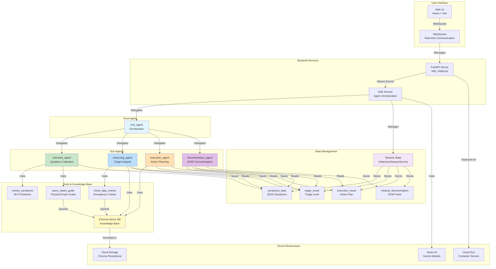
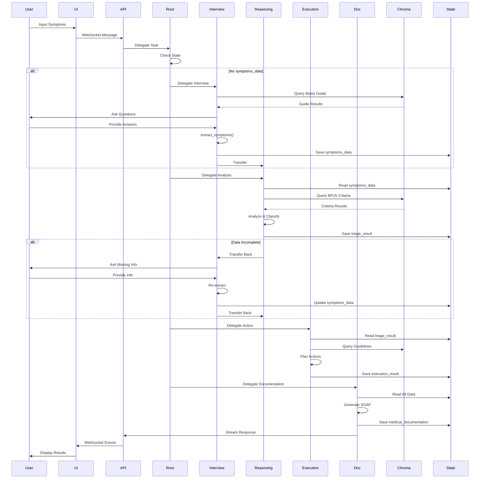
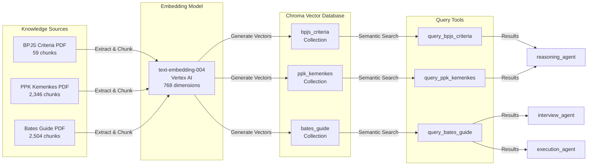
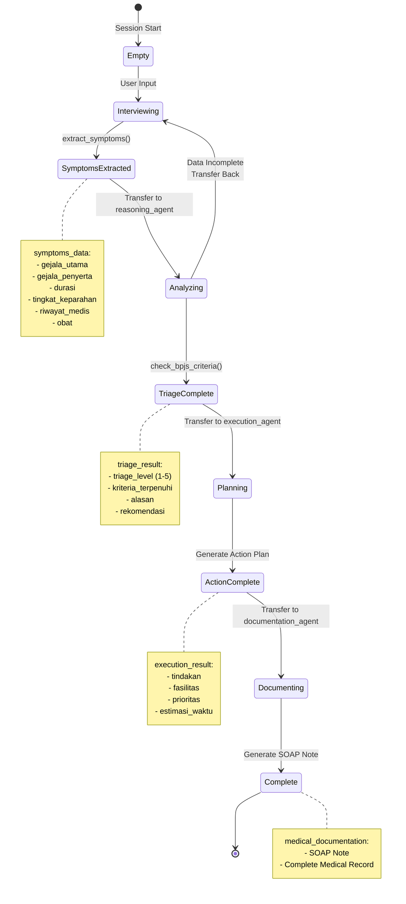
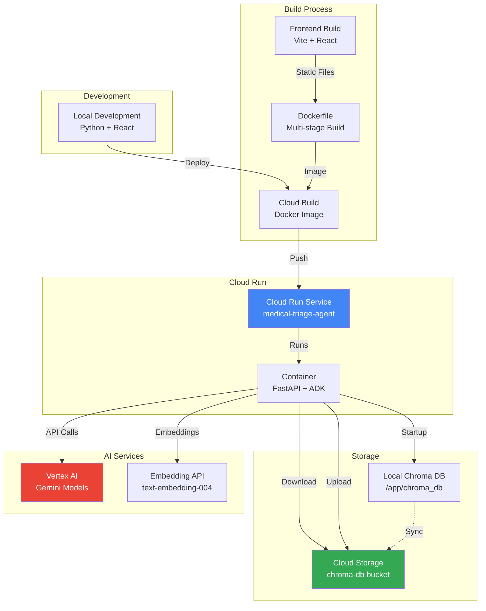
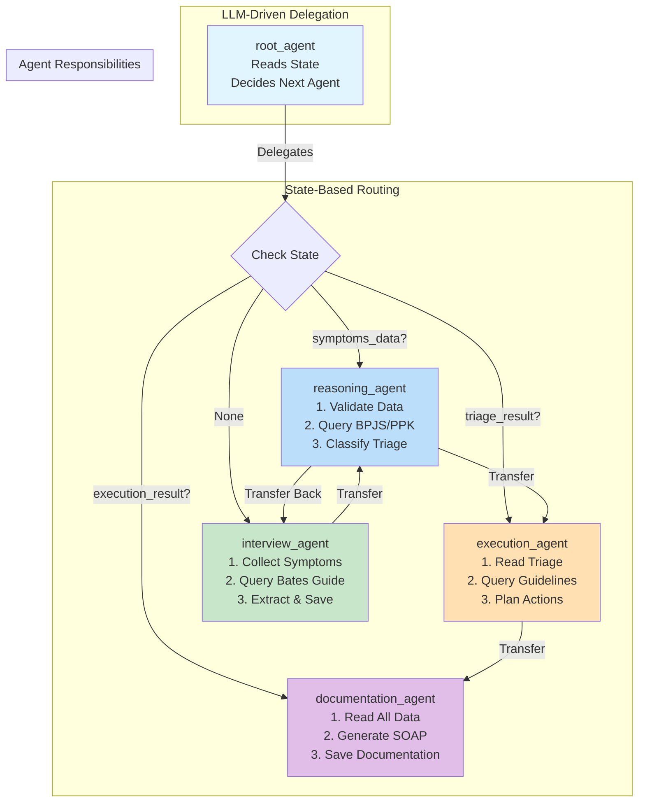

# Medical Triage Agent - Architecture Diagram

## System Architecture Overview

## Agent Workflow

## Knowledge Base Architecture

## State Management Flow

## Deployment Architecture

## Agent Communication Pattern

## Key Components

### 1. **Root Agent (Orchestrator)**

- **Role**: Central coordinator that routes tasks to appropriate sub-agents
- **Decision Logic**: Reads session state and delegates based on workflow stage
- **State Checks**:
  - `symptoms_data` → delegate to `reasoning_agent`
  - `triage_result` → delegate to `execution_agent`
  - `execution_result` → delegate to `documentation_agent`
  - None → delegate to `interview_agent`

### 2. **Interview Agent**

- **Role**: Collects patient symptoms through dynamic conversation
- **Tools**:
  - `extract_symptoms`: NLP extraction to structured JSON
  - `query_bates_guide`: Semantic search for interview guidance
- **Output**: `symptoms_data` (JSON) saved to session state

### 3. **Reasoning Agent**

- **Role**: Analyzes symptoms and determines triage level (1-5)
- **Tools**:
  - `check_bpjs_criteria`: Analyzes against BPJS emergency criteria
  - `query_bpjs_criteria`: Semantic search for relevant criteria
  - `query_ppk_kemenkes`: Semantic search for health guidelines
- **Output**: `triage_result` with classification and justification
- **Validation**: Can transfer back to `interview_agent` if data incomplete

### 4. **Execution Agent**

- **Role**: Plans actions based on triage level
- **Tools**:
  - `query_bpjs_criteria`: For facility recommendations
  - `query_ppk_kemenkes`: For treatment guidelines
- **Output**: `execution_result` with action plan

### 5. **Documentation Agent**

- **Role**: Generates SOAP medical documentation
- **Input**: Reads all previous state (`symptoms_data`, `triage_result`, `execution_result`)
- **Output**: `medical_documentation` (SOAP note)

### 6. **Knowledge Base (Chroma)**

- **Collections**:
  - `bpjs_criteria`: BPJS emergency criteria (59 chunks)
  - `ppk_kemenkes`: Primary health care guidelines (2,346 chunks)
  - `bates_guide`: Physical examination guide (2,504 chunks)
- **Persistence**: Cloud Storage for fast startup
- **Embedding**: Google's `text-embedding-004` (768 dimensions)

### 7. **State Management**

- **Storage**: `InMemorySessionService` (session-scoped)
- **State Keys**:
  - `symptoms_data`: Extracted symptoms (JSON)
  - `triage_result`: Triage classification (JSON)
  - `execution_result`: Action plan (JSON)
  - `medical_documentation`: SOAP note (text)

## Data Flow

1. **User Input** → WebSocket → FastAPI → ADK Runner
2. **Root Agent** → Checks state → Delegates to appropriate agent
3. **Interview Agent** → Queries Bates Guide → Asks questions → Extracts symptoms
4. **Reasoning Agent** → Validates data → Queries BPJS/PPK → Classifies triage
5. **Execution Agent** → Reads triage → Queries guidelines → Plans actions
6. **Documentation Agent** → Reads all data → Generates SOAP → Saves documentation
7. **Response** → ADK Runner → FastAPI → WebSocket → User Interface

## Error Handling & Edge Cases

1. **Incomplete Data**: `reasoning_agent` can transfer back to `interview_agent`
2. **Re-extraction**: `interview_agent` can re-extract after receiving missing info
3. **State Validation**: Each agent validates required state before proceeding
4. **Non-blocking Init**: Chroma initialization runs in background on startup
5. **Cloud Storage Fallback**: If Chroma DB not in GCS, initializes locally then uploads
