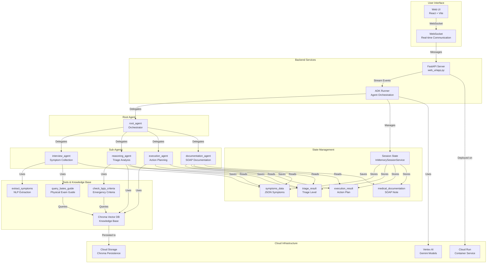
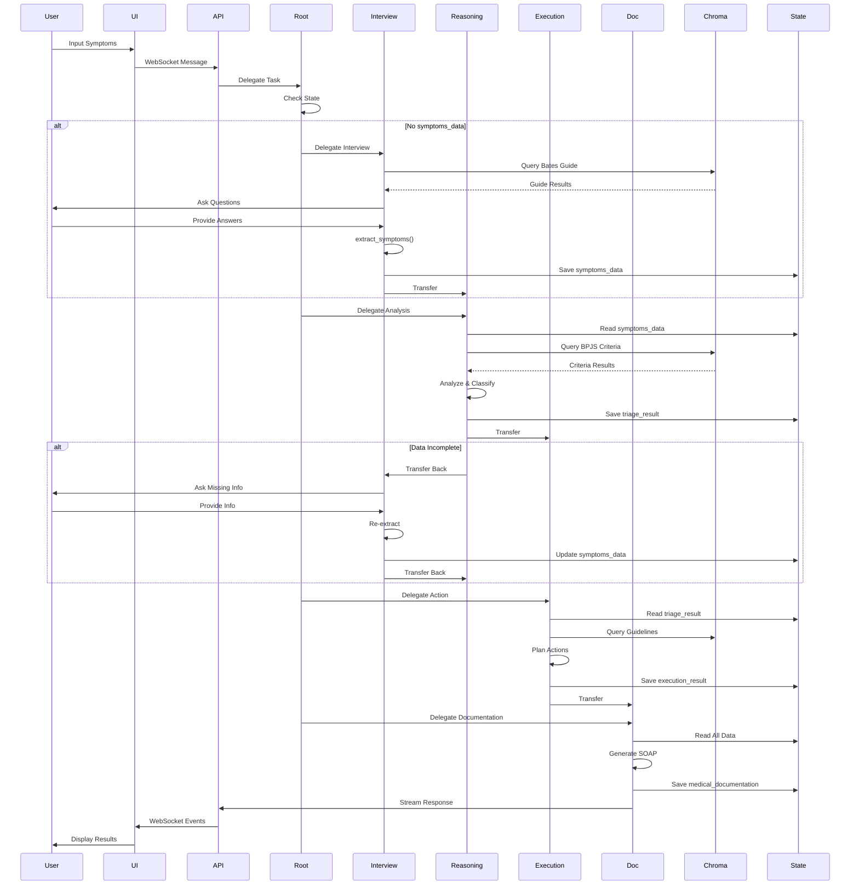
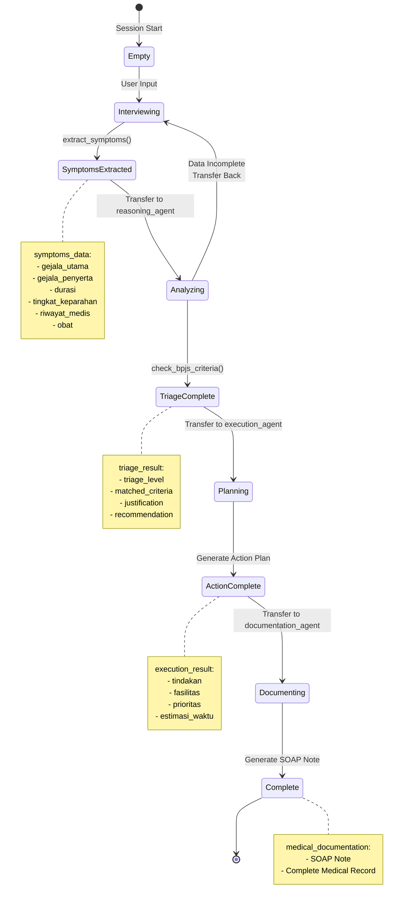
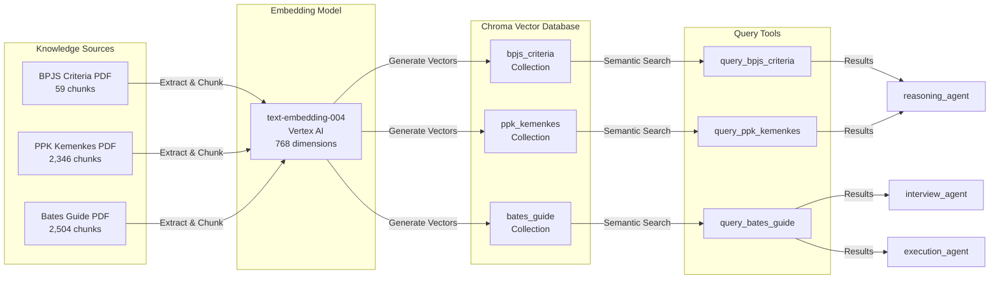
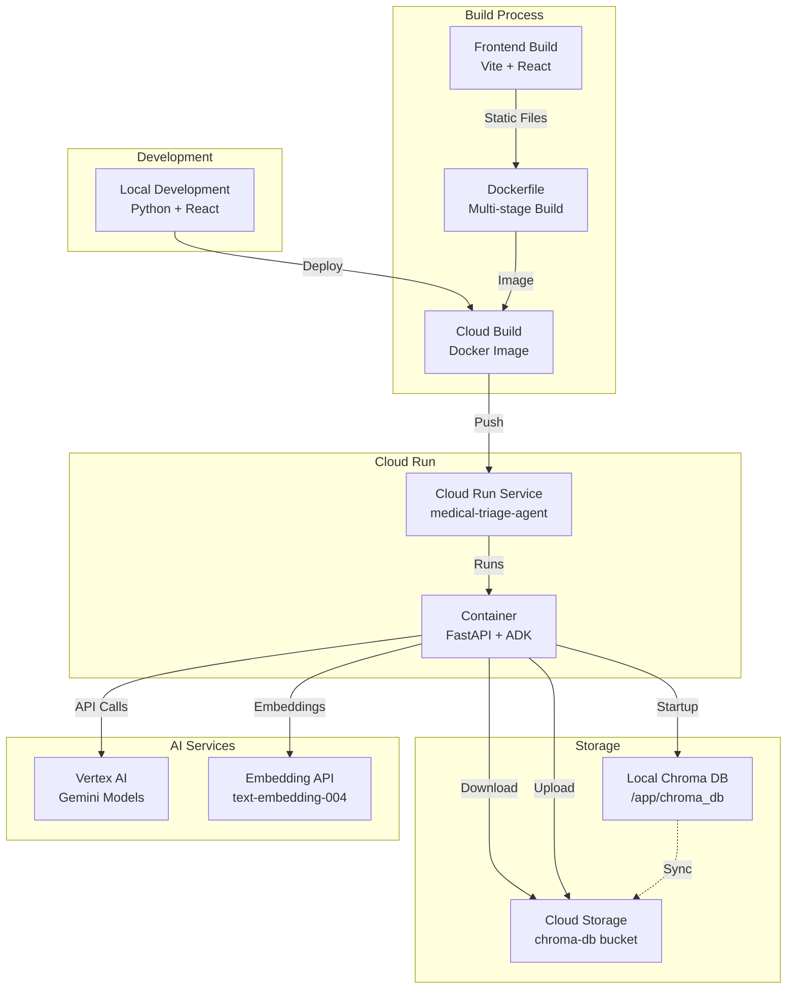

# Medical Triage Agent - Smart Triage System

Sistem triase medis cerdas yang menggunakan multi-agent untuk membantu pasien mendapatkan perawatan yang tepat sesuai tingkat urgensi berdasarkan Kriteria Gawat Darurat BPJS.

## Overview

Medical Triage Agent adalah sistem multi-agent yang mengotomatisasi proses triase medis dengan 5 agen spesialis:

1. **Agent Orkestrator** - Mengelola alur kerja dan mendelegasikan tugas
2. **Agent Wawancara** - Wawancara dinamis dengan pasien (NLP, Bahasa Indonesia)
3. **Agent Penalaran Klinis** - Memetakan gejala ke Kriteria Gawat Darurat BPJS
4. **Agent Eksekusi** - Mengambil tindakan menggunakan API (ambulans, penjadwalan, self-care)
5. **Agent Dokumentasi** - Meringkas percakapan ke format SOAP

## Agent Details

| Feature | Description |
| --- | --- |
| **Interaction Type** | Conversational |
| **Complexity** | Advanced |
| **Agent Type** | Multi Agent |
| **Components** | Tools, AgentTools, Multi-step workflow |
| **Vertical** | Healthcare |

## Tech Stack

### Backend & AI
- **Python 3.12+** - Core programming language
- **Google ADK (Agent Development Kit)** - Multi-agent orchestration framework
- **FastAPI** - Modern web framework for building APIs
- **Uvicorn** - ASGI server for running FastAPI applications
- **Google Vertex AI** - AI platform for Gemini models
- **Gemini 2.5 Flash** - Large language model for agent reasoning
- **text-embedding-004** - Embedding model for semantic search (768 dimensions)
- **Chroma Vector Database** - Vector database for knowledge base storage
- **httpx** - Async HTTP client for API calls

### Frontend
- **React 18** - UI library for building user interfaces
- **TypeScript** - Typed JavaScript for better code quality
- **Vite** - Fast build tool and dev server
- **Tailwind CSS** - Utility-first CSS framework
- **ReactMarkdown** - Markdown renderer for React
- **WebSocket API** - Real-time bidirectional communication

### Infrastructure & DevOps
- **Google Cloud Run** - Serverless container platform
- **Docker** - Containerization for deployment
- **Cloud Build** - CI/CD for automated builds
- **Google Cloud Storage** - Object storage for Chroma DB persistence
- **uv** - Fast Python package manager (replaces pip/poetry)

### Knowledge Base & Data
- **Chroma DB** - Vector database with semantic search
- **PDF Processing** - PDF extraction and chunking
- **Semantic Search** - Vector similarity search for knowledge retrieval

### Development Tools
- **uv** - Python dependency management
- **npm/pnpm** - Node.js package management
- **ESLint** - JavaScript/TypeScript linting
- **Prettier** - Code formatting

### Communication & APIs
- **WebSocket** - Real-time communication protocol
- **REST API** - HTTP-based API endpoints
- **OpenStreetMap Nominatim** - Reverse geocoding service (proxied through backend)

### Key Libraries & Frameworks
- **google-genai** - Google Generative AI SDK
- **chromadb** - Chroma vector database client
- **pydantic** - Data validation using Python type annotations
- **python-dotenv** - Environment variable management

## Architecture

### System Overview

```
root_agent (Orchestrator)
├── interview_agent (Wawancara & Pengumpulan Data)
├── reasoning_agent (Penalaran Klinis & Klasifikasi)
├── execution_agent (Eksekusi Tindakan)
└── documentation_agent (Dokumentasi Medis)
```

### System Architecture Diagram



### Agent Workflow



### Key Components

#### 1. **Root Agent (Orchestrator)**
- **Role**: Central coordinator that routes tasks to appropriate sub-agents
- **Decision Logic**: Reads session state and delegates based on workflow stage
- **State Checks**:
  - `symptoms_data` → delegate to `reasoning_agent`
  - `triage_result` → delegate to `execution_agent`
  - `execution_result` → delegate to `documentation_agent`
  - None → delegate to `interview_agent`

#### 2. **Interview Agent**
- **Role**: Collects patient symptoms through dynamic conversation
- **Tools**:
  - `extract_symptoms`: NLP extraction to structured JSON
  - `query_bates_guide`: Semantic search for interview guidance
- **Output**: `symptoms_data` (JSON) saved to session state

#### 3. **Reasoning Agent**
- **Role**: Analyzes symptoms and determines triage level (Gawat Darurat / Mendesak / Non-Urgen)
- **Tools**:
  - `check_bpjs_criteria`: Analyzes against BPJS emergency criteria
  - `query_bpjs_criteria`: Semantic search for relevant criteria
  - `query_ppk_kemenkes`: Semantic search for health guidelines
- **Output**: `triage_result` with classification and justification
- **Validation**: Can transfer back to `interview_agent` if data incomplete

#### 4. **Execution Agent**
- **Role**: Plans actions based on triage level
- **Tools**:
  - `call_emergency_service`: Calls emergency services for critical cases
  - `schedule_mobile_jkn`: Schedules Mobile JKN visit for urgent cases
  - `get_self_care_guide`: Provides self-care guidance for non-urgent cases
  - `query_fktp_registered`: Queries registered primary health facilities
  - `query_nearest_facility`: Finds nearest health facility
  - `query_jkn_medical_history`: Retrieves patient's medical history
- **Output**: `execution_result` with action plan

#### 5. **Documentation Agent**
- **Role**: Generates SOAP medical documentation
- **Input**: Reads all previous state (`symptoms_data`, `triage_result`, `execution_result`)
- **Output**: `medical_documentation` (SOAP note)

#### 6. **Knowledge Base (Chroma Vector Database)**
- **Collections**:
  - `bpjs_criteria`: BPJS emergency criteria (59 chunks)
  - `ppk_kemenkes`: Primary health care guidelines (2,346 chunks)
  - `bates_guide`: Physical examination guide (2,504 chunks)
- **Persistence**: Cloud Storage for fast startup
- **Embedding**: Google's `text-embedding-004` (768 dimensions)
- **Query Tools**:
  - `query_bpjs_criteria`: Semantic search in BPJS criteria
  - `query_ppk_kemenkes`: Semantic search in PPK Kemenkes guidelines
  - `query_bates_guide`: Semantic search in Bates Guide

### State Management Flow



### Knowledge Base Architecture



### Deployment Architecture



### Data Flow

1. **User Input** → WebSocket → FastAPI → ADK Runner
2. **Root Agent** → Checks state → Delegates to appropriate agent
3. **Interview Agent** → Queries Bates Guide → Asks questions → Extracts symptoms
4. **Reasoning Agent** → Validates data → Queries BPJS/PPK → Classifies triage
5. **Execution Agent** → Reads triage → Queries guidelines → Plans actions
6. **Documentation Agent** → Reads all data → Generates SOAP → Saves documentation
7. **Response** → ADK Runner → FastAPI → WebSocket → User Interface

## Setup and Installation

### Prerequisites

- Python 3.12+
- uv (untuk dependency management)
  ```bash
  curl -LsSf https://astral.sh/uv/install.sh | sh
  ```
- Google Cloud Project (untuk Vertex AI)
- Google Cloud CLI
  ```bash
  gcloud auth application-default login
  ```

#### Enable Required Google Cloud APIs

Untuk menjalankan Medical Triage Agent, Anda perlu mengaktifkan beberapa Google Cloud APIs di project Anda.

**Quick Enable (Via Browser):**

Buka link berikut di browser untuk mengaktifkan APIs:

1. **Vertex AI API** (Required):
   https://console.developers.google.com/apis/api/aiplatform.googleapis.com/overview?project=YOUR_PROJECT_ID

2. **Generative Language API** (Optional, untuk Gemini):
   https://console.developers.google.com/apis/api/generativelanguage.googleapis.com/overview?project=YOUR_PROJECT_ID

Klik "Enable" pada masing-masing halaman, lalu tunggu 2-5 menit untuk propagasi.

**Enable via gcloud CLI:**

```bash
# Set project
gcloud config set project YOUR_PROJECT_ID

# Enable APIs
gcloud services enable aiplatform.googleapis.com
gcloud services enable generativelanguage.googleapis.com

# Verify
gcloud services list --enabled | grep -E "(aiplatform|generativelanguage)"
```

**Troubleshooting:**

Jika masih mendapat error 403 setelah enable:
- Tunggu beberapa menit (propagasi bisa memakan waktu)
- Pastikan project ID di `.env` sesuai
- Verifikasi billing account sudah diaktifkan untuk project
- Cek permissions: Anda perlu role `Service Usage Admin` atau `Project Owner`

### Installation

1. **Clone repository dan navigasi ke direktori:**
   ```bash
   cd python/agents/medical-triage-agent
   ```

2. **Install dependencies:**
   ```bash
   uv sync
   ```

3. **Setup environment variables:**
   
   Buat file `.env` atau set environment variables:
   ```bash
   export GOOGLE_GENAI_USE_VERTEXAI=true
   export GOOGLE_CLOUD_PROJECT=<your-project-id>
   export GOOGLE_CLOUD_LOCATION=<your-project-location>
   ```

   Atau gunakan file `.env`:
   ```bash
   GOOGLE_GENAI_USE_VERTEXAI=true
   GOOGLE_CLOUD_PROJECT=your-project-id
   GOOGLE_CLOUD_LOCATION=us-central1
   ```

## Running the Agent

### Prerequisites Setup

1. **Install Dependencies:**
   ```bash
   cd /home/seryu/projects/bpjs-agentic-ai
   uv sync
   ```

2. **Setup Google Cloud Authentication:**
   ```bash
   gcloud auth application-default login
   ```
   
   **Pastikan project ID Anda sudah benar:**
   ```bash
   gcloud config get-value project
   ```

3. **Setup Environment Variables:**
   
   **Opsi A: Menggunakan file `.env` (Recommended)**
   
   Copy file `.env.example` ke `.env`:
   ```bash
   cp .env.example .env
   ```
   
   Edit file `.env` dan isi dengan project ID dan location Anda:
   ```bash
   GOOGLE_GENAI_USE_VERTEXAI=true
   GOOGLE_CLOUD_PROJECT=your-project-id
   GOOGLE_CLOUD_LOCATION=us-central1
   ```
   
   **Opsi B: Export langsung di terminal**
   ```bash
   export GOOGLE_GENAI_USE_VERTEXAI=true
   export GOOGLE_CLOUD_PROJECT=your-project-id
   export GOOGLE_CLOUD_LOCATION=us-central1
   ```

### Cara 1: Menggunakan ADK CLI (Command Line Interface)

Jalankan agent di terminal untuk interaksi berbasis teks:

```bash
cd /home/seryu/projects/bpjs-agentic-ai
uv run adk run medical_triage_agent
```

**Cara Menggunakan:**
1. Agent akan memulai dengan greeting
2. Ketik pesan Anda dan tekan Enter
3. Agent akan melakukan wawancara medis
4. Ketik `exit` untuk keluar

**Contoh Interaksi CLI:**
```
user: Halo, saya merasa tidak enak badan

[root_agent]: Halo! Saya adalah Smart Triage Agent yang akan membantu 
Anda mendapatkan perawatan yang tepat. Saya akan melakukan wawancara 
singkat untuk memahami keluhan Anda.

Bisa ceritakan keluhan Anda secara detail?

user: Saya demam tinggi sejak pagi, sekitar 39 derajat, dan sesak napas

[interview_agent]: Terima kasih atas informasinya. Untuk membantu saya 
memahami kondisi Anda lebih baik, saya perlu beberapa informasi tambahan:

1. Berapa lama Anda sudah mengalami demam dan sesak napas?
2. Apakah ada gejala lain yang menyertai?
3. Apakah Anda memiliki riwayat penyakit tertentu?
...
```

### Cara 2: Menggunakan ADK Web UI (Web Interface) ✅ **RECOMMENDED**

Jalankan web server untuk interaksi melalui browser dengan interface yang lebih user-friendly:

```bash
cd /home/seryu/projects/bpjs-agentic-ai
uv run adk web
```

**Output yang Diharapkan:**
```
Starting ADK web server...
Server running at: http://127.0.0.1:8000
Open this URL in your browser to interact with the agent.
```

**Cara Menggunakan Web UI:**

1. **Buka Browser:**
   - Buka URL yang ditampilkan (biasanya `http://127.0.0.1:8000` atau `http://localhost:8000`)

2. **Pilih Agent:**
   - Di bagian atas kiri halaman, ada dropdown menu
   - Pilih `medical_triage_agent` dari dropdown
   - Chat interface akan muncul di kanan

3. **Mulai Berinteraksi:**
   - Ketik pesan di chat box di bagian bawah
   - Tekan Enter atau klik tombol Send
   - Agent akan merespons dan melakukan wawancara medis

4. **Lihat Workflow:**
   - Anda dapat melihat seluruh workflow:
     - ✅ Wawancara dengan pasien
     - ✅ Ekstraksi gejala menggunakan LLM
     - ✅ Reasoning dengan BPJS criteria
     - ✅ Eksekusi tindakan (panggil ambulans / booking)
     - ✅ Dokumentasi SOAP

**Keuntungan Web UI:**
- ✅ **User-friendly**: Interface yang lebih mudah digunakan
- ✅ **Visual**: Dapat melihat history percakapan dengan jelas
- ✅ **Demo-ready**: Sangat cocok untuk presentasi dan demo
- ✅ **Real-time**: Log interaksi ditampilkan di terminal secara real-time

**Catatan Penting:**
- Web UI akan tetap berjalan sampai Anda menekan `Ctrl+C` di terminal
- Jangan tutup terminal saat Web UI sedang berjalan
- Log interaksi akan ditampilkan di terminal secara real-time

### Cara 3: Custom Web UI (React Frontend)

Untuk menggunakan custom React frontend dengan fitur tambahan, lihat dokumentasi di [web_ui/README.md](web_ui/README.md).

---

## 🧪 Testing dengan Skenario Berbeda

### Skenario 1: Gawat Darurat

```
User: Saya mengalami nyeri dada yang sangat hebat, sesak napas, dan keringat dingin
```

**Expected Flow:**
1. Interview agent mengumpulkan informasi
2. Reasoning agent mengklasifikasikan sebagai "Gawat Darurat"
3. Execution agent memanggil layanan darurat (mock)
4. Documentation agent membuat SOAP

### Skenario 2: Mendesak

```
User: Saya demam 38 derajat sejak 2 hari lalu, batuk, dan pilek
```

**Expected Flow:**
1. Interview agent mengumpulkan informasi
2. Reasoning agent mengklasifikasikan sebagai "Mendesak"
3. Execution agent melakukan booking Mobile JKN (mock)
4. Documentation agent membuat SOAP

### Skenario 3: Non-Urgen

```
User: Saya merasa sedikit pusing setelah bangun tidur, tapi sudah membaik
```

**Expected Flow:**
1. Interview agent mengumpulkan informasi
2. Reasoning agent mengklasifikasikan sebagai "Non-Urgen"
3. Execution agent memberikan panduan self-care
4. Documentation agent membuat SOAP

---

## 🐛 Troubleshooting

### Error: "GOOGLE_CLOUD_PROJECT not set"

**Solusi:**
```bash
export GOOGLE_CLOUD_PROJECT=your-project-id
# atau edit file .env
```

### Error: "Authentication failed"

**Solusi:**
```bash
gcloud auth application-default login
```

### Error: "Module not found"

**Solusi:**
```bash
uv sync
```

### Error: "Agent not found in dropdown"

**Solusi:**
- Pastikan Anda menjalankan `adk web` dari direktori yang benar
- Pastikan nama agent di `agent.py` adalah `root_agent`
- Cek apakah ada error di terminal

### Web UI tidak muncul

**Solusi:**
- Cek apakah port 8000 sudah digunakan: `lsof -i :8000`
- Coba gunakan port lain atau kill process yang menggunakan port tersebut
- Pastikan firewall tidak memblokir localhost

---

## 📝 Tips untuk Demo Hackathon

1. **Gunakan Web UI** untuk presentasi yang lebih menarik
2. **Siapkan beberapa skenario** (Gawat Darurat, Mendesak, Non-Urgen)
3. **Jelaskan workflow** saat demo:
   - "Sekarang agent sedang melakukan wawancara..."
   - "Agent mengekstrak gejala menggunakan Gemini LLM..."
   - "Agent menganalisis dengan referensi ke dokumen BPJS..."
   - "Agent mengambil tindakan otonom..."
4. **Highlight fitur AI:**
   - Ekstraksi gejala otomatis dengan LLM
   - Reasoning dengan dokumen BPJS resmi
   - Tindakan otonom berdasarkan triage level

## Deployment

Untuk deploy ke production, lihat **[DEPLOYMENT.md](DEPLOYMENT.md)** untuk panduan lengkap dengan semua opsi deployment.

### Quick Deploy ke Cloud Run

```bash
export PROJECT_ID=your-project-id
export REGION=us-central1
gcloud builds submit --config cloudbuild.yaml
```

## Example Interaction

**User:**
```
Halo, saya merasa tidak enak badan
```

**Agent (Orchestrator):**
```
Halo! Saya adalah Smart Triage Agent yang akan membantu Anda mendapatkan 
perawatan yang tepat. Saya akan melakukan wawancara singkat untuk memahami 
keluhan Anda.

Bisa ceritakan keluhan Anda secara detail?
```

**User:**
```
Saya demam tinggi sejak pagi, sekitar 39 derajat, dan sesak napas
```

**Agent (setelah wawancara dan reasoning):**
```
Berdasarkan gejala yang Anda sampaikan, sistem telah mengklasifikasikan 
kondisi Anda sebagai **Gawat Darurat**. 

Layanan darurat telah dipanggil dan ambulans akan tiba dalam 15-20 menit. 
Rumah sakit terdekat telah diberitahu dan siap menerima Anda.

Mohon tetap tenang dan jangan melakukan aktivitas berat.
```

## Workflow

1. **Wawancara**: Agent mengumpulkan gejala, durasi, dan informasi medis relevan
2. **Penalaran**: Gejala dianalisis dan dipetakan ke Kriteria BPJS untuk menentukan triage level
3. **Eksekusi**: Tindakan diambil sesuai level:
   - **Gawat Darurat**: Memanggil layanan darurat
   - **Mendesak**: Menjadwalkan kunjungan ke FKTP via Mobile JKN
   - **Non-Urgen**: Memberikan panduan self-care
4. **Dokumentasi**: Semua interaksi diringkas ke format SOAP dengan rekomendasi kode ICD

## Testing

```bash
uv sync --dev
uv run pytest tests
```

Untuk testing dengan berbagai skenario, lihat bagian [Testing dengan Skenario Berbeda](#-testing-dengan-skenario-berbeda) di atas.

## Customization

### Menambahkan Kriteria BPJS

Edit file `medical_triage_agent/sub_agents/reasoning_agent/tools/tools.py` untuk menambahkan atau memodifikasi kriteria BPJS.

### Mengintegrasikan API Eksternal

Edit file `medical_triage_agent/sub_agents/execution_agent/tools/tools.py` untuk mengintegrasikan:
- API layanan darurat
- API Mobile JKN
- Database/RAG untuk panduan self-care

### Menyesuaikan Format SOAP

Edit file `medical_triage_agent/sub_agents/documentation_agent/tools/tools.py` untuk menyesuaikan format dokumentasi.

## TODO / Next Steps

- [ ] Implementasi ekstraksi gejala menggunakan LLM/NLP yang lebih canggih
- [ ] Integrasi dengan API BPJS resmi untuk kriteria gawat darurat
- [ ] Integrasi dengan API layanan darurat (119, rumah sakit)
- [ ] Integrasi dengan API Mobile JKN untuk penjadwalan
- [ ] Setup RAG system untuk panduan self-care
- [ ] Database mapping gejala ke kode ICD-10/ICD-9
- [ ] Evaluasi dan fine-tuning dengan data real
- [ ] Testing end-to-end dengan berbagai skenario

## Disclaimer

Agent ini dibuat untuk tujuan demonstrasi dan pembelajaran. Belum siap untuk penggunaan produksi tanpa pengujian dan validasi yang menyeluruh. Pastikan untuk:

- Melakukan pengujian ekstensif sebelum deployment
- Memvalidasi logika triage dengan dokter/ahli medis
- Memastikan integrasi API sesuai dengan standar dan regulasi
- Mengimplementasikan error handling dan logging yang robust
- Mematuhi regulasi privasi data medis (HIPAA, dll)

## License

Copyright 2025 Google LLC

Licensed under the Apache License, Version 2.0

